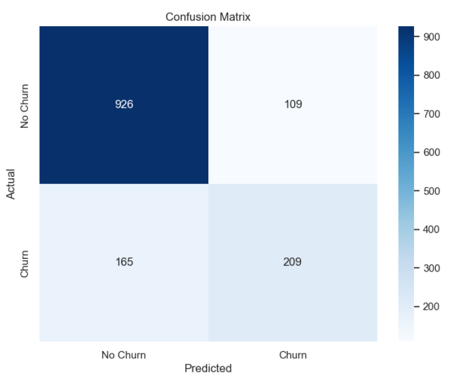

# ChurnGuard: A Predictive Model for Customer Retention

A data-driven solution designed to proactively identify customers at risk of "churning" (canceling their subscription). This project demonstrates a full, end-to-end machine learning workflow, from data cleaning and exploratory analysis to model training and performance evaluation.



---

## 📈 The Business Problem

In the competitive subscription economy, customer retention is paramount. Acquiring a new customer is often 5 to 25 times more expensive than retaining an existing one. Therefore, the ability to predict which customers are likely to leave is a massive strategic advantage. It allows a business to move from a reactive "customer support" model to a proactive "customer success" model, intervening with targeted offers, support, or marketing to save at-risk accounts before they are lost.

## 💡 The Solution

ChurnGuard is a binary classification model built using Python and Scikit-learn. It analyzes a customer's demographic data, account information, and subscribed services to calculate the probability of churn.

This project was developed within a Jupyter Notebook to create a clear, narrative-driven analysis. The model is built using a robust Scikit-learn Pipeline that handles data preprocessing and training in a streamlined and reproducible manner.

### Key Features:

*   **Comprehensive EDA:** Performed exploratory data analysis (EDA) with Seaborn and Matplotlib to uncover key drivers of churn, such as contract type and payment method.
*   **Robust Preprocessing Pipeline:** Constructed a `ColumnTransformer` pipeline to automatically apply standard scaling to numerical features and one-hot encoding to categorical features.
*   **Model Training:** Trained a Logistic Regression model, a powerful and highly interpretable baseline perfect for generating actionable business insights.
*   **In-depth Evaluation:** Assessed the model not just on accuracy, but with a full classification report (Precision/Recall) and a confusion matrix to understand its real-world performance trade-offs.

---

## 📊 Results & Impact

The model achieved an overall accuracy of **80.4%** on the unseen test set.

|             | Precision | Recall | F1-Score |
| :---------- | :-------: | :----: | :------: |
| **No Churn (0)** |   0.83    |  0.92  |   0.87   |
| **Churn (1)**    |   0.66    |  0.45  |   0.54   |

**Key Insight:** The model is very good at correctly identifying customers who will *not* churn (Precision of 0.83, Recall of 0.92). It is moderately successful at identifying customers who *will* churn (Precision of 0.66). The lower recall for the "Churn" class (0.45) indicates a business trade-off: to improve churn detection, the model could be optimized to increase this recall, even at the cost of flagging some loyal customers for retention offers (lower precision). This data directly informs business strategy.

---

## 🛠️ Technology Stack

*   **Core Language:** Python
*   **Data Analysis & Manipulation:** Pandas, NumPy
*   **Data Visualization:** Matplotlib, Seaborn
*   **Machine Learning & Preprocessing:** Scikit-learn
*   **Development Environment:** Jupyter Notebook

---

## 🏁 Getting Started

The entire analysis is contained within the `Churn_Prediction_Analysis.ipynb` notebook.

### 1. Clone the Repository
```bash
git clone https://github.com/Zaid2044/ChurnGuard-Predictive-Model.git
cd ChurnGuard-Predictive-Model
